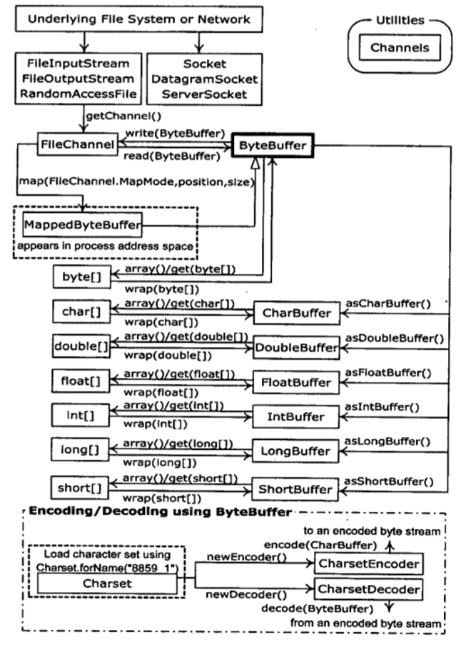
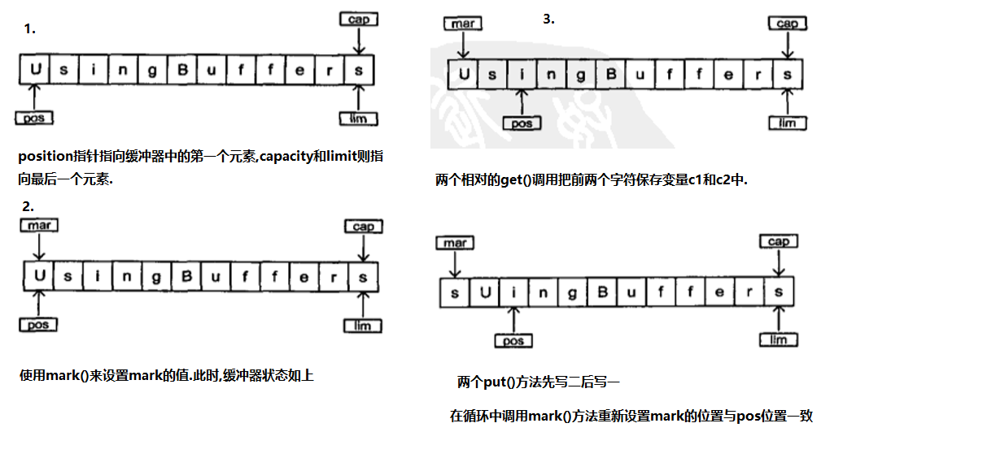

# JavaI/O系统

## 18.7文件读写的实用工具

```java
public class TextFile extends ArrayList<String> {
  // Read a file as a single string:
  public static String read(String fileName) {
    StringBuilder sb = new StringBuilder();
    try {
      BufferedReader in= new BufferedReader(new FileReader(
        new File(fileName).getAbsoluteFile()));
      try {
        String s;
        while((s = in.readLine()) != null) {
          sb.append(s);
          sb.append("\n");
        }
      } finally {
        in.close();
      }
    } catch(IOException e) {
      throw new RuntimeException(e);
    }
    return sb.toString();
  }
  // Write a single file in one method call:
  public static void write(String fileName, String text) {
    try {
      PrintWriter out = new PrintWriter(
        new File(fileName).getAbsoluteFile());
      try {
        out.print(text);
      } finally {
        out.close();
      }
    } catch(IOException e) {
      throw new RuntimeException(e);
    }
  }
  // Read a file, split by any regular expression:
  public TextFile(String fileName, String splitter) {
    super(Arrays.asList(read(fileName).split(splitter)));
    // Regular expression split() often leaves an empty
    // String at the first position:
    if(get(0).equals("")) remove(0);
  }
  // Normally read by lines:
  public TextFile(String fileName) {
    this(fileName, "\n");
  }
  public void write(String fileName) {
    try {
      PrintWriter out = new PrintWriter(
        new File(fileName).getAbsoluteFile());
      try {
        for(String item : this)
          out.println(item);
      } finally {
        out.close();
      }
    } catch(IOException e) {
      throw new RuntimeException(e);
    }
  }
  // Simple test:
  public static void main(String[] args) {
    String file = read("TextFile.java");
    write("test.txt", file);
    TextFile text = new TextFile("test.txt");
    text.write("test2.txt");
    // Break into unique sorted list of words:
    TreeSet<String> words = new TreeSet<String>(
      new TextFile("TextFile.java", "\\W+"));
    // Display the capitalized words:
    System.out.println(words.headSet("a"));//获取比a(97)小的set视图
  }
} /* Output:
[0, ArrayList, Arrays, Break, BufferedReader, BufferedWriter, Clean, Display, File, FileReader, FileWriter, IOException, Normally, Output, PrintWriter, Read, Regular, RuntimeException, Simple, Static, String, StringBuilder, System, TextFile, Tools, TreeSet, W, Write]
*///:~
```

## 18.8 标准I/O

>标准I/O这个术语参考的是Unix中"程序所使用的单一信息流"这个概念.程序的所有输入都可以来自与标准输入,它的所有输出也都可以发送到标准输出,以及所有的错误信息都可以发送到标准错误.  
>标准I/O的意义在于:我们可以很容易地把程序串联起来,一个程序的标准输出可以称为另一个程序的标准输入.强大的工具.

1. Java提供了System.in,System.out和System.err.其中System.out和System.err已经事先被包装成了printStream对象.但是System.in却是一个没有被包装过的未经加工的InputStream.这意味着我们可以立即使用System.out和System.err,但是在读取Ssytem.in之前必须对其进行包装.
2. 通常我们会用readLine()一次一行地读取输入,为此,我们将System.in包装成BufferedReader来使用,这要求我们必须用InputStreamReader把System.in转换成Reader.

```java
public class Echo {
  public static void main(String[] args)
  throws IOException {
    BufferedReader stdin = new BufferedReader(
      new InputStreamReader(System.in));
    String s;
    while((s = stdin.readLine()) != null && s.length()!= 0)
      System.out.println(s);
    // An empty line or Ctrl-Z terminates the program
  }
} ///:~
```


>现在来探究一下标准IO流的源码

```java
public final class System{
    public static final InputStream in = null;
    public static final PrintStream out = null;
    public static final PrintStream err = null;

    private static native void setIn0(InputStream in);
    private static native void setOut0(PrintStream out);
    private static native void setErr0(PrintStream err);//重新制定流
}
```

```java
public class Redirecting {
    public static void main(String[] args) throws IOException {
        PrintStream console = System.out;
        BufferedInputStream in = new BufferedInputStream(new FileInputStream(".\\zhuofai814\\src\\cn\\itcast\\zhuofai\\demo18_8\\Redirecting.java"));
        PrintStream out = new PrintStream(new BufferedOutputStream(new FileOutputStream("test.out")));
        System.setIn(in);
        System.setOut(out);
        System.setErr(out);
        BufferedReader br = new BufferedReader(new InputStreamReader(System.in));
        String s;
        while((s = br.readLine())!=null){
            System.out.println(s);
        }
        out.close();
        System.setOut(console);
    }
}
```

1. 这个程序将标准输入附接到文件上,并将标准输入和标准错误重定向到另一个文件.注意:它在程序开头存储了对最初的System.out对象的引用,并且在结尾处将系统输出恢复到了该对象上
2. I/O重定向操纵的是字节流,而不是字符流,因此我们使用的是InputStream和OutputStream,而不是Reader和Writer.

## 18.9进程控制

## 18.10新IO

>jdk1.4的java.nio.*包引入了新JavaI/O类库,其目的在于提高速度.实际上,旧的I/O包已经使用nio重新实现过,以便充分利用这种速度提高,因此,即使我们不显示地用nio编写代码,也能从中受益.速度提高在文件I/O和网络I/O都有可能发生,我们在这里只研究前者,对于后者,在\<Thinking in Enterprise Java>  
>速度的提高来自于所使用的结构更接近于操作系统执行I/O的方式:通道和缓冲器.

1. 唯一直接与通道交互的缓冲器时ByteBuffer--也就是说,可以存储未加工字节的缓冲器.
2. 旧I/O类中有三个类被修改了,用以产生FileChannel.这三个被修改的类是FIleInputStream.FileOutputStream 以及用于既读又写的RandomAccessFile.注意这些是字节操纵流,与底层的nio性质一致.Reader和Writer这种字符模式类不能用于产生通道,但是java.nio.channels.Channels类提供了实用方法,用以在通道中产生Reader和Writer.

```java
public class GetChannel {
    private static final int BSIZE = 1024;

    public static void main(String[] args) throws IOException {
        //Write a file
        FileChannel fc = new FileOutputStream("data.txt").getChannel();
        fc.write(ByteBuffer.wrap("Some text ".getBytes()));
        fc.close();
        //Add to the end of the file
        fc = new RandomAccessFile("data.txt","rw").getChannel();
        fc.position(fc.size());
        fc.write(ByteBuffer.wrap("Some more".getBytes()));
        fc.close();
        //Read the file
        fc = new FileInputStream("data.txt").getChannel();
        ByteBuffer buff = ByteBuffer.allocate(BSIZE);
        fc.read(buff);
        buff.flip();
        while(buff.hasRemaining())
            System.out.print((char)buff.get());
    }
}
```


1. 对于这里所展示的任何流类,getChannel()将会产生一个FileChannel.通道是一种相当基础的东西:可以向它传送用于读写的ByteBuffer,并且可以锁定文件的某些区域用于独占式访问.
2. 将字节放于ByteBuffer的方法之一是:使用"put"方法直接对它们进行填充,填入一个或多个字节,或基本数据类型的值.如果使用wrap()方法,它将已存在的字节数组"包装"到ByteBuffer中.一旦如此,就不再复制底层的数字,而是把它作为所产生的ByteBuffer的存储器,我们称之为数组支持的ByteBuffer.
3. 对于只读访问,我们必须显式地使用静态allocate()方法来分配ByteBuffer.nio的目标就是快速移动大量数据,因此,ByteBuffer的大小就显得尤为重要
4. 甚至达到更高的速度也有可能,方法就是使用allocateDirect()而不是allocate(),以产生一个与操作系统有更高耦合性的"直接"缓冲器.但是这种分配的开支会更大.
5. 一旦调用read()来告知FileChannel向ByteBUffer存储字节,就必须调用缓冲器上的flip(),让它做好让人读取字节的准备(使得,则似乎有一点拙略,但是请记住,他是很拙略的,但却适用于获取最大速度).如果我们打算使用缓冲器执行进一步的read()操作(read下一个位置),我们也必须得调用clear()来为每个read()做好准备.(clear()清空此缓冲区,将位置设置为 0，将限制设置为容量，并丢弃标记。)

```java
public class BufferToText {
  private static final int BSIZE = 1024;
  public static void main(String[] args) throws Exception {
    FileChannel fc =
      new FileOutputStream("data2.txt").getChannel();
    fc.write(ByteBuffer.wrap("Some text".getBytes()));
    fc.close();
    fc = new FileInputStream("data2.txt").getChannel();
    ByteBuffer buff = ByteBuffer.allocate(BSIZE);
    fc.read(buff);
    buff.flip();
    // Doesn't work:
    System.out.println(buff.asCharBuffer());
    // Decode using this system's default Charset:
    buff.rewind();
    String encoding = System.getProperty("file.encoding");
    System.out.println("Decoded using " + encoding + ": "
      + Charset.forName(encoding).decode(buff));
    // Or, we could encode with something that will print:
    fc = new FileOutputStream("data2.txt").getChannel();
    fc.write(ByteBuffer.wrap(
      "Some text".getBytes("UTF-16BE")));
    fc.close();
    // Now try reading again:
    fc = new FileInputStream("data2.txt").getChannel();
    buff.clear();
    fc.read(buff);
    buff.flip();
    System.out.println(buff.asCharBuffer());
    // Use a CharBuffer to write through:
    fc = new FileOutputStream("data2.txt").getChannel();
    buff = ByteBuffer.allocate(24); // More than needed
    buff.asCharBuffer().put("Some text");
    fc.write(buff);
    fc.close();
    // Read and display:
    fc = new FileInputStream("data2.txt").getChannel();
    buff.clear();
    fc.read(buff);
    buff.flip();
    System.out.println(buff.asCharBuffer());
  }
} /* Output:
????
Decoded using Cp1252: Some text
Some text
Some text
*///:~
```

1. 缓冲容器容纳的是普通的字节,为了把它们转换成字符,我们要么在输入它们的时候对其进行编码(这样,它们输出时才具有意义),要么将其从缓冲器输出时对他们进行编码,要么使用java.nio.cahrset.Charset类实现这些功能,该类提供了把数据编码成多种不同类型的字符集的工具.

```java
public class GetData {
  private static final int BSIZE = 1024;
  public static void main(String[] args) {
    ByteBuffer bb = ByteBuffer.allocate(BSIZE);
    // Allocation automatically zeroes the ByteBuffer:
    int i = 0;
    while(i++ < bb.limit())
      if(bb.get() != 0)
        print("nonzero");
    print("i = " + i);
    bb.rewind();
    // Store and read a char array:
    bb.asCharBuffer().put("Howdy!");
    char c;
    while((c = bb.getChar()) != 0)
      printnb(c + " ");
    print();
    bb.rewind();
    // Store and read a short:
    bb.asShortBuffer().put((short)471142);
    print(bb.getShort());
    bb.rewind();
    // Store and read an int:
    bb.asIntBuffer().put(99471142);
    print(bb.getInt());
    bb.rewind();
    // Store and read a long:
    bb.asLongBuffer().put(99471142);
    print(bb.getLong());
    bb.rewind();
    // Store and read a float:
    bb.asFloatBuffer().put(99471142);
    print(bb.getFloat());
    bb.rewind();
    // Store and read a double:
    bb.asDoubleBuffer().put(99471142);
    print(bb.getDouble());
    bb.rewind();
  }
} /* Output:
i = 1025
H o w d y !
12390
99471142
99471142
9.9471144E7
9.9471142E7
*///:~
```

1. 想ByteBuffer插入基本类型数据的简单的方法是:利用asCharBuffer() asShortBuffer()等获得该缓冲器上的试图,然后使用视图的put()方法.

>public final Buffer rewind()重绕此缓冲区。将位置设置为 0 并丢弃标记。  
>在一系列通道写入或获取 操作之前调用此方法（假定已经适当设置了限制）。例如：  
>out.write(buf);    // Write remaining data  
>buf.rewind();      // Rewind buffer  
>buf.get(array);    // Copy data into array  
>返回：此缓冲区

1. **试图缓冲器**可以让我们通过某个特定的基本数据类型的视窗查看其底层的ByteBuffer.ByteBuffer依然是实际存储数据的地方,"支持"这前面的视图,因此对视图的任何修改都会映射称为对ByteBuffer中数据的修改.


1. **字节存放次序** 不同的机器可能会使用不同的字节排序方法来存储数据."big endian"(高位优先)将最重要的字节存放在地址最低的存储器单元.而"little endian"(低位优先)则是将最重要的字节放在地址最高的存储器单元.
2. **用缓冲器操纵数据** 注意:ByteBuffer是将数据移进通道的唯一方式,并且我们只能创建一个独立的基本类型缓冲器,或者使用"as"方法从ByteBuffer中获得.也就是说我们不能把基本类型的缓冲器转换成ByteBuffer.然而由于我们可以经由视图缓冲器将基本类型数据移进移出ByteBuffer,所以这也就不是什么真正的限制了.




```java
public class UsingBuffers {
  private static void symmetricScramble(CharBuffer buffer){
    while(buffer.hasRemaining()) {
      buffer.mark();
      char c1 = buffer.get();
      char c2 = buffer.get();
      buffer.reset();
      buffer.put(c2).put(c1);
    }
  }
  public static void main(String[] args) {
    char[] data = "UsingBuffers".toCharArray();
    ByteBuffer bb = ByteBuffer.allocate(data.length * 2);
    CharBuffer cb = bb.asCharBuffer();
    cb.put(data);
    print(cb.rewind());
    symmetricScramble(cb);
    print(cb.rewind());
    symmetricScramble(cb);
    print(cb.rewind());
  }
} /* Output:
UsingBuffers
sUniBgfuefsr
UsingBuffers
*///:~
```



>rewind()把position设置到缓冲器的开始位置.

1. **内存映射文件**:为了既能读又能写,我们先由RandomAccessFile开始,获得该文件上的通道,然后调用map()产生MappedByteBuffer.

```java
public class LargeMappedFiles {
  static int length = 0x8FFFFFF; // 128 MB
  public static void main(String[] args) throws Exception {
    MappedByteBuffer out =
      new RandomAccessFile("test.dat", "rw").getChannel()
      .map(FileChannel.MapMode.READ_WRITE, 0, length);
    for(int i = 0; i < length; i++)
      out.put((byte)'x');
    print("Finished writing");
    for(int i = length/2; i < length/2 + 6; i++)
      printnb((char)out.get(i));
  }
} ///:~
```

1. mappedByteBuffer是一种特殊类型的直接缓冲器.我们必须指定映射文件的初始位置和映射区域的长度,这意味着我们可以映射某个大文件的较小部分.

> The file appears to be accessible all at once because only portions of it are brought into memory, and other parts are swapped out. This way a very large file (up to 2 GB) can easily be modified.

```java
//性能比较,注意test()方法包括初始化各种IO对象的时间,因此,即使建立映射文件的花费很大,但是整体受益比起I/O流来说还是很显著的.
/* Output: (90% match)
Stream Write: 0.56
Mapped Write: 0.12
Stream Read: 0.80
Mapped Read: 0.07
Stream Read/Write: 5.32
Mapped Read/Write: 0.02
*///:~
```