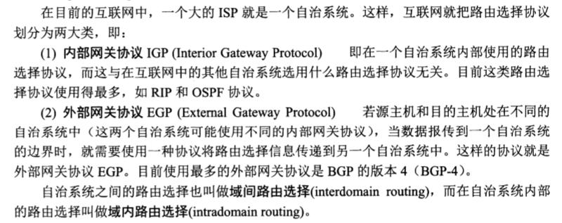

# 计算机网络

## 第一章:重要的概念

1. 计算机网络(简称网络)由若干结点(node)和连接这些结点的链路(link)组成.
2. 网络把许多计算机连接在一起,而互连网则把许多网络通过路由器连接在一起.与网络相连的计算机常称为主机.
3. internet(互连网)是一个通用名词,它泛指由多个计算机网络互连而成的计算机网络.
4. Internet(互联网,或因特网)则是一个专用名词,它指当前全球最大的 开放的 由众多网络相互连接而成的特定互连网,它采用TCP/IP协议族作为通信的规则,且其前身是美国的ARPANET.
5. 开放系统互连基本参考模型OSI/RM(Open System Interconnection Reference Model),简称OSI.
6. 网络协议三要素
    * 语法,即数据与控制信息的结构或格式
    * 语义,即需要发出何种控制信息,完成何种动作以及做出何种反应
    * 同步,即事件实现顺序的详细说明(含有时序的意思)

7. 计算机网络各层需要完成的功能主要有:
    * 差错控制 : 使相应层次对等方的通信更加可靠.
    * 流量控制 : 发送端的发送速率必须使接受端来的及接受,不要太快.
    * 分段和重装 : 发送端将要发送的数据块划分为更小的单位,在接收端将其还原.
    * 复用和分用 : 发送端几个高层会话复用一条底层的连接,在接收端再进行分用.
    * 连接建立和释放 : 交换数据会先建立一条逻辑连接,数据传送结束后释放连接.


## 第二章物理层

1. 复用(multiplexing)是通信技术中的基本概念.最基本的复用FDM(Frequency Division Multiplexing)和时分复用TDM(Time Division Multiplexing).
2. 波分复用WDM(Wavelength Division Multiplexing)就是光的频分复用
3. 码分复用CDM(Code Division Multiplexing)另名CDMA码分多址(Code Division Multiple Access).
4. 物理层的主要任务就是确定与传输媒体的接口相关的一些特性,如机械特性 电气特性 功能特性和过程特性
5. 根据双方信息交互的方式,通信可以划分为单向通信(或单工通信) 双向交替通信(或半双工通信)和双向同时通信(或全双工通信).

## 第三章链路层

1. 数据链路层协议的三个基本问题:
    * 封装成帧(framing):就是在一段数据的前后分别添加首部和尾部,这样就构成了一个帧.
    * 透明传输(出现帧定界错误):表示无论什么样的比特组合的数据,都嗯哪狗狗按照原样没有差错的通过这个数据链路层.因此对所传送的数据来说,这些数据"看不见"数据链路层有什么妨碍数据传输的东西.或者说,数据链路层对这些数据来说是透明的.(解决方案字节填充(byte stuffing)或字符填充(character stuffing)).
    * 差错检测(比特差错):01字符串中0变1 1变0等问题.CRC循环冗余检查问题解决.但并没有解决"出现传输差错"(帧丢失 帧重复 帧失序).这些差错将由传输层的TCP面向链接的可靠传输来解决.
2. PPP（点到点协议）是为在同等单元之间传输数据包这样的简单链路设计的链路层协议。这种链路提供全双工操作，并按照顺序传递数据包。设计目的主要是用来通过拨号或专线方式建立点对点连接发送数据，使其成为各种主机、网桥和路由器之间简单连接的一种共通的解决方案。特点:简单,只检查差错,不纠正,不使用序号,不进行流量控制,可支持多种网络层协议
3. 局域网的数据链路层:网络为一个单位所拥有,且地理范围和站点数目均有限.


```java
由此想说明适配器的物理地址是不可变的,只能通过更换适配器来改变其物理地址.
通常来讲IP地址就是你家的地址门牌号,而MAC物理地址就是你的身份证号.
ipconfig/all
无线局域网适配器 本地连接* 3:

   媒体状态  . . . . . . . . . . . . : 媒体已断开连接
   连接特定的 DNS 后缀 . . . . . . . :
   描述. . . . . . . . . . . . . . . : Microsoft Wi-Fi Direct Virtual Adapter #2
   物理地址. . . . . . . . . . . . . : 96-65-9C-76-34-AF
   DHCP 已启用 . . . . . . . . . . . : 是
   自动配置已启用. . . . . . . . . . : 是

以太网适配器 以太网:

   连接特定的 DNS 后缀 . . . . . . . :
   描述. . . . . . . . . . . . . . . : Realtek PCIe FE Family Controller
   物理地址. . . . . . . . . . . . . : 20-47-47-DD-3E-95
   DHCP 已启用 . . . . . . . . . . . : 是
   自动配置已启用. . . . . . . . . . : 是
   本地链接 IPv6 地址. . . . . . . . : fe80::108f:974b:c9d3:f08%2(首选)
   IPv4 地址 . . . . . . . . . . . . : 192.168.16.27(首选)
   子网掩码  . . . . . . . . . . . . : 255.255.255.0
   获得租约的时间  . . . . . . . . . : 2018年10月21日 星期日 8:29:51
   租约过期的时间  . . . . . . . . . : 2018年10月21日 星期日 21:57:03
   默认网关. . . . . . . . . . . . . : 192.168.16.1
   DHCP 服务器 . . . . . . . . . . . : 192.168.16.2
   DHCPv6 IAID . . . . . . . . . . . : 35669831
   DHCPv6 客户端 DUID  . . . . . . . : 00-01-00-01-22-5D-1F-01-20-47-47-DD-3E-95
   DNS 服务器  . . . . . . . . . . . : 119.29.29.29
   TCPIP 上的 NetBIOS  . . . . . . . : 已启用
无线局域网适配器 WLAN:

   媒体状态  . . . . . . . . . . . . : 媒体已断开连接
   连接特定的 DNS 后缀 . . . . . . . :
   描述. . . . . . . . . . . . . . . : Intel(R) Dual Band Wireless-AC 3165
   物理地址. . . . . . . . . . . . . : 94-65-9C-76-34-AF
   DHCP 已启用 . . . . . . . . . . . : 是
   自动配置已启用. . . . . . . . . . : 是
```

1. CSMA/CD协议,意思是载波监听多点接入/碰撞检测(Carrier Sense Multiple Access with Collision Detection).
    * 先听后发
    * 边听边发
    * 冲突停止
    * 等待重发
2. 总线以太网使用CSMA/CD协议,以半双工方式工作.但以太网交换机(星型网络)不适用共享总线,没有碰撞问题,因此不使用CSMA/CD,而是以全双工方式工作.(帧结构未变)

## 第四章网络层

>网络层为主机之间提供逻辑通信

1. 网际协议IP是TCP/IP体系中两个最主要的协议之一,也是最重要的互联网标准协议之一.其配套协议有
    * 地址解析协议ARP(Address Resolution Protocol):;
    * 网际控制报文协议ICMP(Internet Control Message Protocol);
        * 允许小主机或路由报考差错情况和提供有关异常情况的报告.
        * ICMP差错报告报文和ICMP询问报文
    * 网际组管理协议IGMP(Internet Goup Management Protocol):用于多播
2. 划分地址A类地址,B类地址,C类地址,D类地址,E类地址.
3. 二级IP地址不够灵活(网络号+主机号)→三级IP地址::={<网络号>,<子网号>,<主机号>}
4. 子网掩码(subnet mask)又叫网络掩码、地址掩码、子网络遮罩，它是一种用来指明一个IP地址的哪些位标识的是主机所在的子网，以及哪些位标识的是主机的位掩码。子网掩码不能单独存在，它必须结合IP地址一起使用。子网掩码只有一个作用，就是将某个IP地址划分成网络地址和主机地址两部分.;(当想其他主机发送数据时先和子网掩码做and运算然后比对做下一跳).
5. 最终我们现在使用的是CIDR(Classless Inter-Domain Routing)无分类域间路由选择
    * CIDR消除了传统的A类 B类 和C类地址以及划分子网的概念.又回到了二级编址IP地址::=<网络前缀>,<主机号>
    * CIDR把网络前缀都相同的连续的IP地址组成一个"CIDR地址块".
6. 
7. 寻找路由方案:最长前缀匹配还有二叉树线索查找路由表
8. 网关协议:
    * 内部网关协议RIP:是一种分布式的基于距离向量的路由选择协议,是互联网的标准协议,最大优点就是简单.
    * 内部网关协议OSPF:最短路径优先(Open Shortest Path First)
9. 路由器结构图:
10. 

## 第五章运输层

>为应用进程之间提供端到端的逻辑通信.
>运输层的复用(multiplexing)和分用(demultiplexing) "复用":是指在发送方不同的应用进程都可以使用同一个运输层协议传输数据."分用":是指接收方的运输层在剥去报文的首部后能够把这些数据正确交付目的应用进程.

1. 运输层为相互通信的应用进程提供逻辑通信
    > 逻辑通信的意思是:从应用层来看,只要把应用报文交给下面的运输层,运输层就可以把着报文传送到对方的运输层,好像这种通信就是沿水平方向直接传输数据.即"好像是这样通信,但事实上但并非真的这样通信".
2. 
3. UDP
    * UDP是无连接的,即发送数据之前不需要建立连接
    * UDP使用尽最大努力交付,即不保证可靠交付,因此主机不需要维持复杂的连续状态表.
    * UDP是面向报文的.(所以会有长度限制)
    * UDP没有拥塞控制
    * UDP支持一对一,一对多,多对一和多对多的交互通信
    * UDP首部开销小
4. TCP
    * TCP是面向连接的运输层协议.
    * 每一条TCP连接只能有两个端点(endpoint),每一条TCP连接只能是点对点的
    * TCP提供可靠交付的服务.
    * TCP提供全双工通信.
    * 面向字节流.虽然应用程序和TCP的交互是一次一个数据块,但TCP把应用程序交下来的数据仅仅看成是一连串的无结构的字节流.
5. TCP连接::={socket1,socket2}={(IP1:port1),(IP2:port2)}
6. TCP可靠传输的实现
    * 连续ARQ协议(滑动窗口协议)
    * 超时重传事件的选择,自适应算法
    * 选择确认SACK
7. TCP的流量控制
    * 利用滑动窗口实现流量控制.
8. TCP的拥塞控制
    * 慢开始(slow-start)
    * 拥塞避免(congestion avoidance)
    * 快重传(fast retransmit)
    * 快恢复(fast recovery)
9. 

## 第六章应用层

1. 运输层为应用进程提供了端到端的通信服务.但不同的网络应用的进程之间,需要有不同的通信规则.所以还需要有应用层协议(application layer protocol)
2. 域名系统（英文：Domain Name System，缩写：DNS）是互联网的一项服务。它作为将域名和IP地址相互映射的一个分布式数据库，能够使人更方便地访问互联网。DNS使用TCP和UDP端口53[1]。当前，对于每一级域名长度的限制是63个字符，域名总长度则不能超过253个字符。
3. 
4. 
5. 主机向本地域名服务器的查询一般都是采用递归查询(recursive query).本地域名服务器向根域名服务器的查询通常是采用迭代查询(iterative query)
6. 文件传输协议（英文：File Transfer Protocol，缩写：FTP）是用于在网络上进行文件传输的一套标准协议，使用客户/服务器模式。它属于网络传输协议的应用层。文件传送（file transfer）和文件访问（file access）之间的区别在于：前者由FTP提供，后者由如NFS等应用系统提供[1]。参考文献RFC959定义了此规范。
7. 万维网www:
    * 互联网和万维网这两个词通常没有多少区别。但是，两者并不相同。互联网是一个全球互相连接的计算机网上系统。相比之下，万维网是透过超链接和统一资源标志符连接的全球收集的文件和其他资源。万维网资源通常使用HTTP访问，这是许多互联网通信协议的其中之一[20]。

    * 若要进入万维网上一个网页，或者其他网络资源的时候，通常需浏览器上键入你想访问网页的统一资源定位符（URL），或者通过超链接方式链接到那个网页或网络资源。这之后的工作首先是URL的服务器名部分，被名为域名系统的分布于全球的因特网数据库解析，并根据解析结果决定进入哪一个IP地址（IP Address）。

    * 接下来的步骤是为所要访问的网页，向在那个IP地址工作的服务器发送一个HTTP请求。在通常情况下，HTML文本、图片和构成该网页的一切其他文件很快会被逐一请求并发送回用户。

    * 网络浏览器接下来的工作是把HTML、CSS和其他接受到的文件所描述的内容，加上图像、链接和其他必须的资源，显示给用户。这些就构成了你所看到的“网页”。
    * 大多数的网页自身包含有超链接指向其他相关网页，可能还有下载、源文献、定义和其他网络资源。像这样通过超链接，把有用的相关资源组织在一起的集合，就形成了一个所谓的信息的“网”。这个网在因特网上被方便使用，就构成了最早在1990年代初蒂姆·伯纳斯-李所说的万维网[21][22]。
8. 统一资源定位符URL是用来表示从互联网上得到的资源位置和访问这些资源的方法.
    * 构成<协议>://<主机>:<端口>/<路径>
    * 比如清华大学的主页(URL)http://www.tsinghua.edu.cn
9. HTTP协议最重要的两个特点
    * 本身是无连接的:虽然HTTP使用了TCP连接,但通信的双方在交换HTTP报文之前不需要先建立HTTP连接.
    * HTTP协议是无状态的(stateless).也就是说,同一个客户第二次访问同一个服务器上的页面时,服务器的响应与第一次被访问时相同.因为服务器并不记得曾经访问过的这个用户,也不记得该客户曾经服务过多少次.是它容易支持大量并发的HTTP请求.
10. HTTP/1.1协议使用了持续连接(persistent connection).就是万维网服务器在发送响应后仍然在一段事件内保持这条连接.
11. HTTP1.1持续连接的两种工作方式
    * 非流水线方式(without pipelining):是客户在收到前一个相应后才能发出下一个请求
    * 流水线方式(with pipelining):客户端收到HTTP的响应报文之前就能够接着发送新的请求报文.
12. 代理服务器(proxy server)是一种网络实体,又称万维网高速缓存(Web cache).
13. 
14. HTTP是无状态的,但是在实际过程中我们希望能够识别用户.用到了cookie
    * 工作流程:当用户使用某个使用Cookie的网站时,该网站的服务器就会为A产生一个唯一的识别码,并以此作为索引在服务器的后端数据库中产生一个项目.接着在A的HTTP响应报文中添加一个叫做Set-cookie的首部行.
    * 当客户收到这个响应时,其浏览器就在它管理的特定Cookie文件中添加一行,其中包括这个服务器的主机名和Set-cookie后面给出的识别码.继续浏览网站时,浏览器就会从将其放入HTTP请求报文的Cookie首部行中

## 其他

1. 